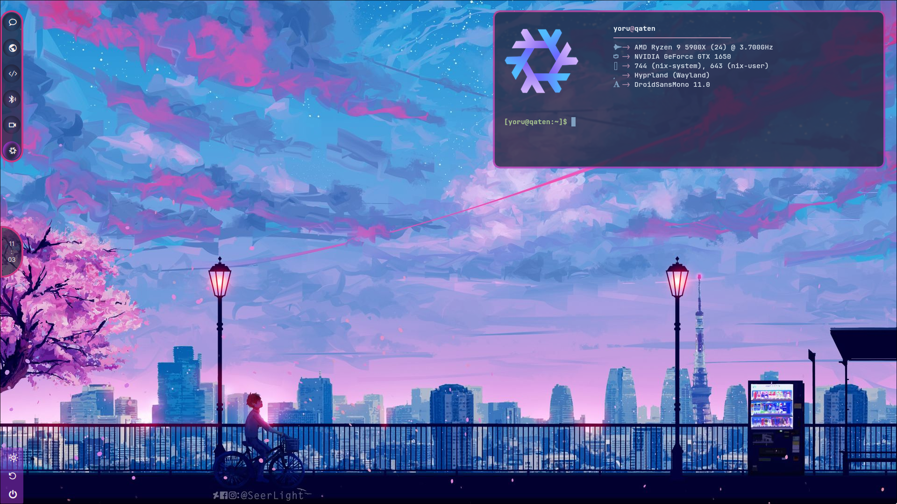

# YorPuter
A pretty cool system on wayland with some cool widgets.



<br />

# Required directories
Since these are located at `/` it would be desirable if these are mountpoints or symlinks.
.

> **Note:** Ability to change locations rolling out soon.

## [`/dat`](usrs/default.nix#L31)
Home folders: `Desktop`, `Documents`, `Videos`, `Pictures`, `Music`
## [`/cred`](usrs/default.nix#L38)
Secrets like `.ssh` and `.wakatime.cfg`

# Try it out!
```
$ git clone git@github.com:YorQat/my-nixos.git
```

## Installing from a nixos live environment
* Since this is manual installation, consider reading on [nixos mount points]("https://nixos.org/manual/nixos/stable/index.html#sec-installation-manual-partitioning")

* Partitions should look like this on your live environment. Tip: I just turned on esp flag for boot partition using [gparted](https://gparted.org/)
```
/
├── mnt/
│   └── boot/
└── ...
```

> **Note:** Make sure you are cd'd correctly as it will override [hardware-configuration.nix](hardware-configuration.nix)
```sh
# Generate config to persist mount points
$ nixos-generate-config --root /mnt --show-hardware-config > hardware-configuration.nix

# Install on /mnt
# Replace <hostName> with your host name like .#qat
$ nixos-install --root /mnt --flake .#<hostName>
```

## Launch window manager
```sh
$ Hyprland
```

## Rebuilding on changes

> **Note:** If you update hardware or change mount points just regenerate hardware configuration
> 
> `$ nixos-generate-config --show-hardware-config > hardware-configuration.nix`
```sh
$ nixos-rebuild switch --flake .#<hostName> -v
```


> **Warning:** Changing [`userName`](setup/default.nix#L16) don't move your stuff but will create a new home directory.