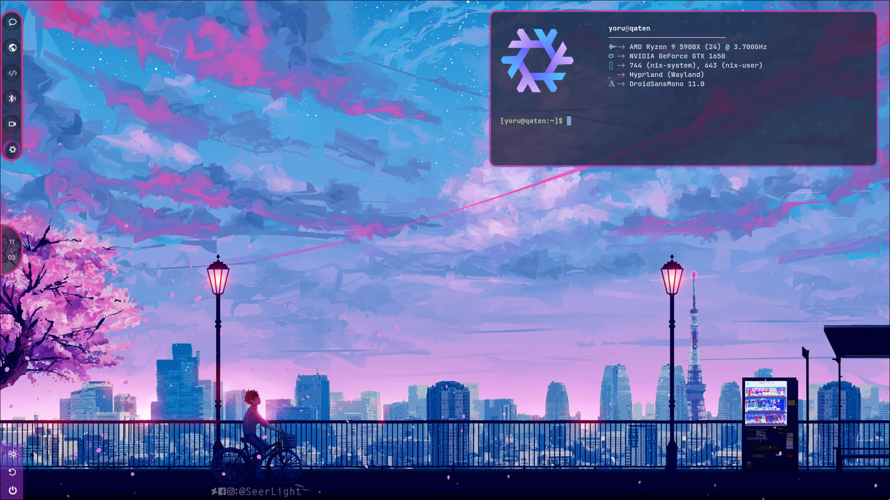

# YorPuter
A pretty cool system on wayland with some cool widgets.



<br />

## What's in the box
- [niri](https://github.com/YaLTeR/niri) scrollable-tiling wayland compositor, with eww widgets and stylix theming
- [sops-nix](https://github.com/Mic92/sops-nix) for secrets (age-encrypted, committed to the repo)
- [impermanence](https://github.com/nix-community/impermanence) on btrfs subvolumes — `/` is wiped at every boot, only whitelisted paths persist
- home-manager, niri-flake, nixvim/nvchad, lanzaboote (secure boot is wired up but off by default)

## Repo tour
```
setup/default.nix           <- THE config. user, host, locale, toggles. start here
hardware-configuration.nix  <- disks/mounts (machine-specific, regenerate per install)
sys/                        <- system-level modules (boot, core, nvidia, wayland)
usrs/                       <- home-manager config (niri, eww, shell, apps)
secrets/                    <- sops-encrypted payloads, deployed at boot
devshell/                   <- `nix develop` gives you the `secrets` util
```

# The config in the config
Almost everything personal lives in [`setup/default.nix`](setup/default.nix):

- `userName` / `hostName` — the host is built as `nixosConfigurations.<hostName>`, so
  changing `hostName` changes what you pass to `--flake .#<hostName>`
- `timeZone`, `defaultLocale`, `extraLocale`
- `lite` — **start with `lite = true` on a fresh install.** It gates everything that
  assumes this machine: the nvidia driver module, the ollama daemon, and the plasma6
  session. With `lite = true` you get niri + core apps on anything; flip it to `false`
  only on hardware that actually has those things (or flip individual
  `includes.<name>` flags for fine control)
- `symLinks` — home dirs (`Documents`, `Downloads`, ...) are symlinked onto `/dat` via
  tmpfiles rules. Point these at wherever your data disk is, or make `/dat` a symlink itself

> **Note:** changing `userName` won't move your stuff — it creates a fresh home directory.

<br />

# Disk layout
This config expects btrfs subvolumes with an ephemeral root:

```
/dev/nvme0n1p5   -> /boot      (vfat, ESP)
/dev/nvme0n1p6   -> /          (btrfs subvol @,        wiped every boot)
                    /nix       (btrfs subvol @nix)
                    /persist   (btrfs subvol @persist, neededForBoot)
/dev/sda1        -> /dat       (btrfs, documents/media/code; home dirs symlink into it)
```

Everything outside [`/persist`](sys/mods/core/persistence.nix) is blank at boot. The
persistence module whitelists `/var/log`, `/var/lib/{bluetooth,nixos,NetworkManager,...}`,
`/etc/machine-id`, the sops key, and all of `/home`. **Anything you create that should
survive a reboot must be added to that list** — or live on `/dat`.

<br />

# Secrets
Managed by sops-nix: payloads are encrypted in [`secrets/`](secrets/) with age, committed
to the repo, and deployed at boot into their home locations (`~/.ssh/*`, `~/.wakatime.cfg`)
with `0600` permissions.

The age key must exist in **two places, identical**:
- `~/.config/sops/age/keys.txt` — for editing secrets
- `/var/lib/sops-nix/key.txt` — for decrypting at boot (backed up to `/persist` by impermanence)

**Back this key up somewhere offline.** Every secret in the repo is unrecoverable without it.

To use your own key instead of mine (you should):
```sh
$ nix shell nixpkgs#age
$ age-keygen -o ~/.config/sops/age/keys.txt
$ mkdir -p /var/lib/sops-nix && cp ~/.config/sops/age/keys.txt /var/lib/sops-nix/key.txt
```
Then put your public key in [`.sops.yaml`](.sops.yaml) and re-encrypt everything:
`sops updatekeys secrets/*`.

Manage payloads from the devshell:

```sh
$ nix develop
$ secrets add <name> <file>   # stage, encrypt, git add; warns if unregistered
$ secrets edit <name>         # decrypt, open $EDITOR, re-encrypt
$ secrets rename <old> <new>  # git mv, no re-encryption needed
$ secrets rm <name>           # remove a payload
$ secrets list                # encryption and registration status
```

New names must be registered in [`userSecrets`](sys/mods/core/secrets.nix) — and
`deployPath` extended if they should not land in `~/.ssh/` — the util will remind you.

<br />

# Try it out!

## Installing from a nixos live environment
Boot a NixOS ISO, then partition like this (tip: set the esp flag on the boot partition
with [gparted](https://gparted.org/)):

```
p1  vfat   1G+    /boot (ESP)
p2  btrfs  rest   / /nix /persist subvolumes
(+ optional data disk for /dat)
```

Create the subvolumes and mount everything:

```sh
# mkfs
mkfs.fat -F 32 /dev/<efi-part>
mkfs.btrfs -L nixos /dev/<root-part>

# create subvolumes
mount /dev/<root-part> /mnt
btrfs subvolume create /mnt/@
btrfs subvolume create /mnt/@nix
btrfs subvolume create /mnt/@persist
umount /mnt

# mount the real layout
mount -o subvol=@,compress=zstd,noatime /dev/<root-part> /mnt
mount --mkdir -o subvol=@nix,compress=zstd,noatime /dev/<root-part> /mnt/nix
mount --mkdir -o subvol=@persist,compress=zstd,noatime /dev/<root-part> /mnt/persist
mount --mkdir /dev/<efi-part> /mnt/boot
mount --mkdir -o compress=zstd,noatime /dev/<data-part> /mnt/dat   # optional
```

> **Note:** `/persist` **must** stay `neededForBoot = true` in
> [hardware-configuration.nix](hardware-configuration.nix) — sops secrets and impermanence
> both need it mounted before the system activates. If you `nixos-generate-config`, re-add
> the `subvol=` options and `neededForBoot` afterwards.

Now make it yours:
1. Edit [`setup/default.nix`](setup/default.nix) — at minimum `userName`, `hostName`,
   `timeZone`, the locales, and **`lite = true`** (leaves out nvidia/ollama/plasma6;
   flip it later if your hardware wants them)
2. Update the device UUIDs in [hardware-configuration.nix](hardware-configuration.nix)
   to match your disks (`lsblk -f`)
3. Generate your own age key and re-encrypt the secrets (see above) — you can't decrypt mine
4. Create your own password hash — the user password is a sops secret:
   ```sh
   $ mkpasswd -m sha-512 > /tmp/hash   # then from the devshell:
   $ secrets add <name>-password-hash /tmp/hash
   ```
   and point [`hashedPasswordFile`](sys/host/default.nix) at the new secret.

Clone and install:

```sh
$ git clone https://github.com/yorqat/nixo.git && cd nixo
$ nixos-install --root /mnt --flake .#<hostName>
```

> **Warning:** flakes ignore untracked files. If you added anything new (secrets
> payloads included), `git add` it **before** installing/rebuilding, or sops silently
> deploys nothing.

Reboot, log in through sddm (niri session is in there alongside plasma6).

## Rebuilding on changes
```sh
$ nixos-rebuild switch --flake .#<hostName> -v
```

> **Note:** if you update hardware or change mount points, regenerate:
> `$ nixos-generate-config --show-hardware-config > hardware-configuration.nix`
> — then re-check the `subvol=` options and `neededForBoot` note above.

Gotchas learned the hard way:
- `sudo nixos-rebuild` re-roots `flake.lock`. If evals then fail with "Permission denied":
  `sudo chown $USER:users flake.lock`
- secrets payloads live under `secrets/` as whole-file **binary** format — don't rename
  them by hand, use `secrets rename`
- to sanity-check a change without switching:
  `nix eval .#nixosConfigurations.<hostName>.config.system.build.toplevel.drvPath`
